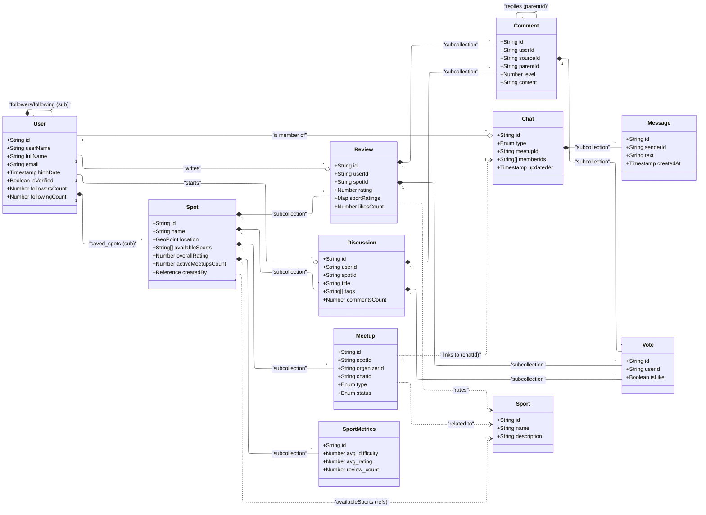

# Firebase Data Transfer Objects (DTOs)

This document outlines the data structures used in the application, corresponding to the Firestore documents.

## Users Domain

### `User`

Represents a user profile.

| Field                | Type        | Description                      |
| :------------------- | :---------- | :------------------------------- |
| `id`                 | `string`    | User ID (matches Auth UID)       |
| `userName`           | `string`    | Unique username                  |
| `fullName`           | `string`    | Display name                     |
| `bio`                | `string`    | User biography                   |
| `email`              | `string`    | Contact email                    |
| `profileUrl`         | `string`    | URL to profile image             |
| `birthDate`          | `Timestamp` | Date of birth                    |
| `phoneNumber`        | `string`    | Verified phone number            |
| `isVerified`         | `boolean`   | Verification status              |
| `createdAt`          | `Timestamp` | Account creation date            |
| `updatedAt`          | `Timestamp` | Last profile update              |
| `favoriteSpotsCount` | `number`    | Count of saved spots (favorites) |
| `reviewsCount`       | `number`    | Count of reviews posted          |
| `followersCount`     | `number`    | Count of followers               |
| `followingCount`     | `number`    | Count of users following         |
| `commentsCount`      | `number`    | Count of comments posted         |

**Relationships:**

- **Followers**: Subcollection `followers/{userId}` contains `{ userId, createdAt }`.
- **Following**: Subcollection `following/{userId}` contains `{ userId, createdAt }`.
- **Saved Spots**: Subcollection `saved_spots/{spotId}` contains `{ spotId, categories[], savedAt }`.

---

## Spots Domain

### `Spot`

Represents a physical location or venue for sports.

| Field                | Type        | Description                       |
| :------------------- | :---------- | :-------------------------------- |
| `id`                 | `string`    | Spot ID                           |
| `name`               | `string`    | Name of the spot                  |
| `description`        | `string`    | Detailed description              |
| `gallery`            | `string[]`  | Array of image URLs               |
| `contactPhone`       | `string`    | Contact phone                     |
| `contactEmail`       | `string`    | Contact email                     |
| `contactWebsite`     | `string`    | Website URL                       |
| `availableSports`    | `string[]`  | List of sport IDs or names        |
| `location`           | `GeoPoint`  | Latitude and Longitude            |
| `geohash`            | `string`    | Geohash for location queries      |
| `isActive`           | `boolean`   | If spot is active/visible         |
| `isVerified`         | `boolean`   | If spot is verified by admin      |
| `overallRating`      | `number`    | Aggregated average rating         |
| `reviewsCount`       | `number`    | Total number of reviews           |
| `activeMeetupsCount` | `number`    | Count of currently active meetups |
| `createdAt`          | `Timestamp` | Creation date                     |
| `createdBy`          | `Reference` | Reference to creating User        |

**Relationships:**

- **Reviews**: Subcollection `reviews`.
- **Discussions**: Subcollection `discussions`.
- **Meetups**: Subcollection `meetups`.
- **Metrics**: Subcollection `sport_metrics` (stats per sport).

---

## Reviews Domain

### `Review`

A user's review of a spot.

| Field           | Type                       | Description                 |
| :-------------- | :------------------------- | :-------------------------- |
| `id`            | `string`                   | Review ID                   |
| `userId`        | `string`                   | ID of the reviewer          |
| `spotId`        | `string`                   | ID of the spot              |
| `content`       | `string`                   | Text content of the review  |
| `rating`        | `number`                   | Overall rating (1-5)        |
| `sportRatings`  | `Map<string, SportRating>` | Ratings breakdown by sport  |
| `gallery`       | `string[]`                 | Images attached to review   |
| `likesCount`    | `number`                   | Count of likes              |
| `dislikesCount` | `number`                   | Count of dislikes           |
| `commentsCount` | `number`                   | Count of comments on review |
| `reports`       | `number`                   | Count of reports            |
| `createdAt`     | `Timestamp`                | Creation date               |

### `SportRating` (Nested Object)

| Field         | Type     | Description                |
| :------------ | :------- | :------------------------- |
| `sportRating` | `number` | Rating for specific sport  |
| `difficulty`  | `number` | Difficulty level (1-5)     |
| `content`     | `string` | Optional comment for sport |

**Relationships:**

- **Comments**: Subcollection `comments` (threaded).
- **Votes**: Subcollection `votes` (likes/dislikes).

---

## Discussions Domain

### `Discussion`

A forum topic or question related to a spot.

| Field           | Type        | Description                |
| :-------------- | :---------- | :------------------------- |
| `id`            | `string`    | Discussion ID              |
| `userId`        | `string`    | Author ID                  |
| `spotId`        | `string`    | Related Spot ID            |
| `title`         | `string`    | Title of discussion        |
| `titleLower`    | `string`    | Lowercase title for search |
| `description`   | `string`    | Body text                  |
| `tags`          | `string[]`  | Related tags               |
| `media`         | `string[]`  | Attached images/video      |
| `likesCount`    | `number`    | Count of likes             |
| `dislikesCount` | `number`    | Count of dislikes          |
| `commentsCount` | `number`    | Count of comments          |
| `reports`       | `number`    | Count of reports           |
| `createdAt`     | `Timestamp` | Creation date              |

**Relationships:**

- **Comments**: Subcollection `comments`.
- **Votes**: Subcollection `votes`.

---

## Comments Domain

### `Comment`

A comment on a Review or Discussion. Supports nesting.

| Field        | Type                       | Description                          |
| :----------- | :------------------------- | :----------------------------------- |
| `id`         | `string`                   | Comment ID                           |
| `userId`     | `string`                   | Author ID                            |
| `contextId`  | `string`                   | Usually `spotId`                     |
| `sourceType` | `'review' \| 'discussion'` | Type of parent entity                |
| `sourceId`   | `string`                   | ID of parent Review or Discussion    |
| `sourceRef`  | `Reference`                | DB Ref to parent doc                 |
| `parentId`   | `string`                   | ID of immediate parent (for threads) |
| `level`      | `number`                   | Nesting level (0 = root)             |
| `content`    | `string`                   | Comment text                         |
| `media`      | `string[]`                 | Attached media                       |
| `likesCount` | `number`                   | Count of likes                       |
| `createdAt`  | `Timestamp`                | Creation date                        |

**Relationships:**

- **Votes**: Subcollection `votes`.
- **Replies**: Other comments with `parentId` pointing to this comment.

---

## Meetups Domain

### `Meetup`

An organized event at a Spot.

| Field               | Type        | Description                                |
| :------------------ | :---------- | :----------------------------------------- |
| `id`                | `string`    | Meetup ID                                  |
| `spotId`            | `string`    | Location Spot ID                           |
| `organizerId`       | `string`    | User ID of organizer                       |
| `chatId`            | `string`    | Reference to Chat document                 |
| `title`             | `string`    | Event title                                |
| `description`       | `string`    | Event details                              |
| `type`              | `Enum`      | `CASUAL`, `TOURNAMENT`, `MATCH`, `ROUTINE` |
| `status`            | `Enum`      | `SCHEDULED`, `ACTIVE`, `CANCELLED`, etc    |
| `participantsCount` | `number`    | Number of joined users                     |
| `createdAt`         | `Timestamp` | Creation date                              |

**Specific Fields by Type:**

- **Casual**: `sport` (string), `minParticipants` (number), `date` (Timestamp).
- **Routine**: `daysOfWeek` (number[]), `time` (string).

**Relationships:**

- **Chat**: Links to `chats` collection via `chatId`. Participants are managed via the Chat members.
- **Spot**: Parent collection `spots`.

---

## Chats Domain

### `Chat`

A chat room (DM, Group, or Meetup).

| Field         | Type                              | Description                           |
| :------------ | :-------------------------------- | :------------------------------------ |
| `id`          | `string`                          | Chat ID                               |
| `type`        | `'direct' \| 'group' \| 'meetup'` | Chat type                             |
| `meetupId`    | `string`                          | Linked Meetup ID (if type is meetup)  |
| `name`        | `string`                          | Chat name (for groups)                |
| `memberIds`   | `string[]`                        | Array of User IDs (for easy querying) |
| `lastMessage` | `Map`                             | Preview of last message               |
| `updatedAt`   | `Timestamp`                       | Last activity time                    |

### `Message` (Subcollection)

| Field       | Type        | Description     |
| :---------- | :---------- | :-------------- |
| `id`        | `string`    | Message ID      |
| `senderId`  | `string`    | User ID         |
| `text`      | `string`    | Message content |
| `createdAt` | `Timestamp` | Sent time       |

**Relationships:**

- **Members**: Subcollection `members` stores detailed member info and roles.

---

## Votes Domain

### `Vote`

Represents a Like/Dislike action.

| Field       | Type        | Description                  |
| :---------- | :---------- | :--------------------------- |
| `id`        | `string`    | Usually matches `userId`     |
| `userId`    | `string`    | User who voted               |
| `isLike`    | `boolean`   | true = Like, false = Dislike |
| `createdAt` | `Timestamp` | Vote time                    |

**Location:**
Found in subcollections of Reviews, Comments, and Discussions.

---

## Entity Relationship Diagram

